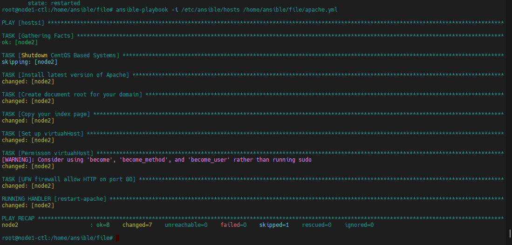

<h1 align="center">Ansible-Playbook</h1>

- Ansible rất linh hoạt khi hỗ trợ playbook bằng ngôn ngữ YAML (file .yml)
- KHi cần thực hiện Setup server/service, chỉ cần gọi file .yml tất cả sẽ được thực thi 1 cách tự động


# I. Cấu trúc dòng lệnh và các Options
## Playbook Structure
- Playbook là một tập hợp chưa 1 hoặc nhiều nhiệm vụ thực thi. playbook hoạt động theo mô hình lần lượt, được khai bao trước thì thực hiện trước

<h3 align="center"></h3>

- Playbook có chức năng lập lên 1 bản kế hoạt thực thi công việc dựa trên 1 hay nhiều máy chủ cụ thể
- cấu trúc dòng lệnh
```sh
ansible-playbook [-h] [--version] [-v] [-k]
                     [--private-key PRIVATE_KEY_FILE] [-u REMOTE_USER]
                     [-c CONNECTION] [-T TIMEOUT]
                     [--ssh-common-args SSH_COMMON_ARGS]
                     [--sftp-extra-args SFTP_EXTRA_ARGS]
                     [--scp-extra-args SCP_EXTRA_ARGS]
                     [--ssh-extra-args SSH_EXTRA_ARGS] [--force-handlers]
                     [--flush-cache] [-b] [--become-method BECOME_METHOD]
                     [--become-user BECOME_USER] [-K] [-t TAGS]
                     [--skip-tags SKIP_TAGS] [-C] [--syntax-check] [-D]
                     [-i INVENTORY] [--list-hosts] [-l SUBSET]
                     [-e EXTRA_VARS] [--vault-id VAULT_IDS]
                     [--ask-vault-password | --vault-password-file VAULT_PASSWORD_FILES]
                     [-f FORKS] [-M MODULE_PATH] [--list-tasks]
                     [--list-tags] [--step] [--start-at-task START_AT_TASK]
                     playbook [playbook ...]
```

- Diễn dải Options:

| Optios | Common Options |
|--------------|-------|
| `--ask-vault-password, --ask-vault-pass` | yêu cầu xác thực password |
| `--become-method <BECOME_METHOD>` | lựa chọn và thay đổi phương pháp thực thi (default=sudo) |
| `--become-user <BECOME_USER>` | lưa chọn user thực thi câu lệnh (default=roo |
| `--flush-cache` | xóa cache thông tin máy chủ lưu trong inventory |
| `--force-handlers` | tiếp tục thi thực thi khi 1 nhiệm vụ thực hiện thất bại |
| `--list-hosts` | hiển thị danh sách host |
| `--list-tags` | liệt kê danh sách các tags |
| `--list-tasks` | liệt kê tất cả các nhiệm vụ sẽ thưc hiện |
| `--private-key <PRIVATE_KEY_FILE>, --key-file <PRIVATE_KEY_FILE>` | Sử dụng file xác thục |
| `--scp-extra-args <SCP_EXTRA_ARGS>` | chỉ định các đối số bổ sung với SCP |
| `--sftp-extra-args <SFTP_EXTRA_ARGS>` | chỉ định các đối số bổ sung với SFTP |
| `--skip-tags` | bỏ qua tags  |
| `--ssh-common-args <SSH_COMMON_ARGS>` | truyền đối số cho sftp/scp/ssh |
| `--ssh-extra-args <SSH_EXTRA_ARGS>` | truyền đối số cho ssh |
| `--start-at-task <START_AT_TASK>` | chạy playbook với task có tên chỉ định |
| `--step` | xác nhận từng tác vụ trươc khi khỏi chạy |
| `--version` | kiểm tra phiên bản ansible |
| `C, --check` | không thực hiện thay đổi nào và dự đoán các thay đổi có thể diễn ra |


# II. Định dạng của Playbook
- Playbook có định dạng YAML chưa danh sách các mô tả chỉ thị với mục đính tự động hóa trên server từ xa
- YAML dựa vào việc thụt đầu dòng để sắp xếp cấu trúc dữ liệu dẫn đến cần cần thận và chú ý đến các dấu cách đầu dòng đặc biệt với các trường hợp `coppy` và `paste`


## 1. Làm việc với các biến
- Cách đơn giản nhất để xác định các biến là sử dụng section có tên là vars của Playbook.

Ví dụ dưới đây, ta định nghĩa biến package – biến mà sau này được sử dụng bên trong các Task
```sh
---
- hosts: all
  become: true
  vars:
         - vars/default.yml
- tasks:
    - name: Install latest version of Apache
      apt: name="{{package}}" update_cache=yes state=latest
```
> Biến package có phạm vi sử dụng trên toàn Playbook

## 2. Sử dụng vòng lặp

Ta sử dụng vòng lặp khi phải lặp lại cùng một task nhiều lần, chỉ khác giá trị input.

- Trong trường hợp muốn sử dụng vòng lặp cài 20 đến 30 package khác nhau **`with_items`** kèm theo bên dưới là 1 mảng các giá trị

```sh
---
- hosts: all
  become: true
  vars:
         - vars/default.yml
- tasks:
    - name: Install latest version of Apache
      apt: name="{{item}}" update_cache=yes state=latest
      with_items:
      - apache2
      - mariadb-server
```

## 3. Sử dụng các điều kiện (Conditionals)

- Các điều kiện được sử dụng để tự động quyết định xem liệu một task có được thực thi hay không dựa trên một biến hay một output từ một nguồn, ví dụ : output của một command
- ví dụ: 
```sh
  - name: Shutdown CentOS Based Systems
    command: /sbin/shutdown -t now
    when: ansible_facts['distribution'] == "CentOS"
```

- trong ví dụ này sử dụng biến `ansible_facts`( biến đặc biệt của Ansible) là `ansible_facts[‘distribution’]` với mục đích kiểm tra OS trên các node client. Nếu các node này cài `Centos` sẽ thực thi lệnh `Shutdown` nó 


## 4. Làm việc với các Template

- Các Template được sử dụng để thiết lập các cấu hình, cho phép sử dụng các biến và các tính năng khác với mục đính làm cho các tệp trở nên linh hoạt hơn và dễ dàng sử dung lại

ví dụ: tạo 1 file index.html có nội dung như sau:
```sh
root@node1-ctl:/home/ansible/file# cat index.html
<h1 align="center">Wellcome demo Ansible-Playbook</h1>
<html>
   <head>
       <title>{{ http_host }}</title>
   </head>
   <body>
       <h1 align="center">Wellcome demo Ansible-Playbook</h1>
   </body>
</html>
root@node1-ctl:/home/ansible/file#
```
-  thực hiện khai báo task Template trong Playbook
```sh
    - name: Copy your index page
      template:
        src: "templates/index.html.j2"
        dest: "/var/www/{{ http_host }}/index.html"
```
- Task này có nhiệm vụ coppy file : index.html.j2 đến thư mục được khởi tạo ở node client

## 5. Khai báo và kích hoạt các Handler

- `handler ` sử dụng đẻ kích hoạt trạng thái của service như start, stop, restart
- Các handler trong giống các Task nhưng chỉ được kích hoạt bởi 1 chỉ thị **notify** bên trong 1 task
- Chúng thường được khai báo như một mảng trong phần handlers của playbook nhưng cũng hoàn toàn có thể đặt trong các tệp riêng biệt

```sh
  tasks:
    - name: Set up virtuahHost
      template:
        src: "templates/apache.conf.j2"
        dest: "/etc/apache2/sites-available/{{ http_conf }}"
      notify:
      - restart-apache
  handlers:
    - name: restart-apache
      service:
        name: apache2
        state: restarted
```

# III. thực thi Playbook

- Đây là 1 mẫu Playbook viết về cài đặt apache và add virtualhost trên Ubuntu20.04

```sh
- hosts: hosts1
  become: true
  vars_files:
         - default.yml
  tasks:
    - name: Shutdown CentOS Based Systems
      command: /sbin/shutdown -t now
      when: ansible_facts['distribution'] == "CentOS"

    - name: Install latest version of Apache
      apt: name=apache2 update_cache=yes state=latest

    - name: Create document root for your domain
      file:
        path: "/var/www/{{ http_host }}"
        state: directory
        owner: "{{ app_user }}"
        mode: '0755'

    - name: Copy your index page
      template:
        src: "templates/index.html.j2"
        dest: "/var/www/{{ http_host }}/index.html"

    - name: Set up virtuahHost
      template:
        src: "templates/apache.conf.j2"
        dest: "/etc/apache2/sites-available/{{ http_conf }}"
      notify: restart-apache

    - name: Permisson virtuahHost
      shell: |
        sudo ln -s /etc/apache2/sites-available/{{ http_conf }} /etc/apache2/sites-enabled/
        sudo apachectl configtest


    - name: "UFW firewall allow HTTP on port {{ http_port }}"
      ufw:
        rule: allow
        port: "{{ http_port }}"
        proto: tcp

  handlers:
    - name: restart-apache
      service:
        name: apache2
        state: restarted
```

- Một số điểm ta cần chú ý là:
  - `hosts: hosts1` playbook sẽ bắt đầu áp dụng cho 1 node hay 1 group được khai báo trong inventory . cụ thể hosts1 ở đây là node 2 đã được khai báo
  - `become: True` : Ansible sẽ sử dụng leo thang đặc quyền (sudo) để chạy tất cả các task trong playbook.
  - `vars` : Khai báo các biến
  - `tasks` : Nơi các task được khai báo.
  - `handlers` : Nơi các service cùng trạng thái của nó được khai báo.


## Chạy một Playbook

- Để thực hiện chạy playbook ta có thể thực hiện lệnh sau:
```sh
ansible-playbook -i path_to_inventory_file path_to_playbook
```
  - `-i` : Chỉ định đường dẫn inventory file

ví dụ:
```sh
ansible-playbook -i /etc/ansible/hosts /home/ansible/file/apache.yml
```

<h3 align="center"></h3>

- kiểm tra 

<h3 align="center"></h3>

# IV. Tài liệu hướng dẫn

- [1] https://linoxide.com/ansible-playbook-to-install-and-setup-apache-on-ubuntu/

- [2] https://github.com/phancong0897/Congphan/blob/master/Ansible/L%C3%BD%20Thuy%E1%BA%BFt/Asible-playbook.md

- [3] https://docs.ansible.com/ansible/latest/cli/ansible-playbook.html

- [4] https://www.scaleway.com/en/docs/tutorials/install-apache-ansible/