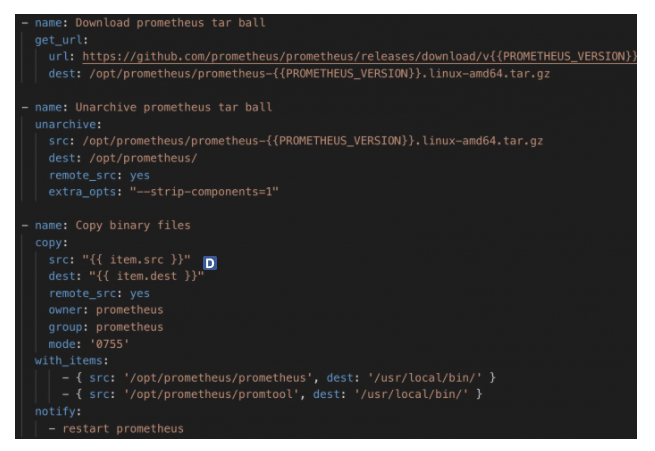

<h1 align="center">Tìm hiểu về Ansible-Role</h1>

# I. khái niệm về Role?
- Trong Ansible, Role là một cơ chế để tách 1 playbook ra thành nhiều file. Việc này nhằm đơn giản hoá việc viết các playbook phức tạp và có thể tái sử dụng lại nhiều lần

- Role không phải là playbook. Role là một bộ khung (framework) để chia nhỏ playbook thành nhiều files khác nhau. Mỗi role là một thành phần độc lập, bao gồm nhiều variables, tasks, files, templates, và modules bên dưới.

- Tổ chức playbook theo role cũng giúp người dùng dễ chia sẻ và tái sử dụng lại playbook cho người tiếp theo. Đối với các Doanh nghiệp có từ vài trăm đến hàng ngìn playbookb thì role chính là giải pháp quản lý các Playbook

- Ở cấu trúc thư mục thì role phân tách các thông tin gồm các task,vars,...
  - `group_vars`: chứa thông tin toàn cục và có thể sử dụng toàn bộ cấu hình
  - `roles`: Là thư mục chứa thông tin cấu hình phân tách của từng role. Ở đây gồm các roles như: apache, common, mariadb, nginx, php và wordpress. Trong mỗi role đó thì gồm các thông tin cấu hình về tasks, var, .. hoặc templates của riêng mỗi role đó.
  - `inventory`: là tệp tin chứa thông tin ansible host mà chúng ta sẽ khai báo, thay vì sử dụng tệp tin cấu hình mặc định tại đường dẫn **/etc/ansible/hosts**
  - `playbook.yml`: là tệp tin playbook chứa thông tin các play. Nếu không tổ chức playbook theo cấu trúc thư mục thì tất cả thông tin về tasks, templates, vars, … mà chạy của mỗi play sẽ được liệt kê trong một tệp playbook. Với cấu trúc thư mục, chúng ta chỉ cần khai báo thông tin về play mà có các roles sẽ chạy, khi đó nó sẽ có nhiệm vụ gọi đến tasks được khai báo trong các tệp tin cấu hình ở thư mục roles ở trên.

# II. Ví dụ về Role

 đây là ví dụ về 1 role đơn giản 

 – Trong folder ./roles/prometheus  

<h3 align="center"></h3>

- Một Role có 7 folder khác nhau gồm: `vars`, `templates`, `handlers`, `files`, `meta`, `tasks`, `defaults` và  1 file `main.yml`. Tasks thường là folder quan trọng nhất, thường dùng để chứa những playbook.
Trong đó:
  - tasks – chứa danh sách các task chính được thực thi trong role này.
  - handlers – chứa các handler, có thể được dùng trong role này hoặc các role khác.
  - defaults – chứa các biến được dùng default cho role này
  - vars – chứa thông tin các biến dùng trong role, biến trong vars sẽ override biến trong default
  - files – chứa các file cần dùng để deploy trong role này, cụ thể như file binary, file cài đặt…
  - templates – chứa các file template theo jinja format đuôi *.j2 (có thể là file config, file systemd…).
  - meta – định nghĩa 1 số metadata của role này, như là dependencies


- Một role phải chứa ít nhất 1 trong 7 thư mục này để Ansible có thể hiểu được đó là 1 role

```sh
alertmanager
├── README.md
├── defaults
│   └── main.yml
├── files
│   ├── alertmanager.service
│   └── notifications.tmpl
├── handlers
│   └── main.yml
├── tasks
│   └── main.yml
├── templates
│   └── alertmanager.yml.j2
└── vars
    └── main.yml
```

<h4 align="center">Cây thư mục của 1 role</h4>


- Để dùng 1 role thì ta có thể liệt kê role cần dùng trong 1 play, cụ thể như sau:
```sh
---
- name: Setup Monitoring Services
  hosts: prometheus_group
  become: yes
  become_user: root
 
  roles:
      - prometheus
      - alertmanager
      - pushgateway
```

Trong ví dụ trên, ta sẽ setup 3 role lần lượt là prometheus, alertmanager và pushgateway cho host prometheus_group

- Để dùng role thì ta cần liệt kê role đó trong 1 play
- Các lệnh như copy, script, template trong 1 role có thể tham chiếu tới `roles/x/{files,templates,tasks}/` trong role đó mà không cần phải ghi rõ đường dẫn tuyệt đối ra
- Một role thường thì cần phải:
  - Chạy được trong check mode `ansible-playbook –check targets.yml`
  - Không chạy lại lần 2 nếu playbook không thay đổi (Idempotent!!)
  - Nên dùng lệnh assert trong playbook để kiểm tra các điều kiện khi chạy playbook
  - Các file config trong folder template nên dùng lệnh `validate` trước khi copy file
  - Chỉ nên trigger các handler khi file config thay đổi
  - Nên có sẵn nhiều biến trong defaults nhất có thể
  - Dùng một tool version control (git, svm…) để theo dõi sự thay đổi của role

# III. Hướng dẫn viết Role

- Sau đây là các bước để viết 1 role trong ansible
```sh
1. Tạo folder role trước, nếu chưa có. Folder này phải có tên là roles
2. Tạo 1 folder trước một role cụ thể. Ví dụ: prometheus
3. Tạo folder tasks để chứa playbook setup prometheus
4. Tạo folder vars để chứa các biến cần dùng trong khi setup prometheus
5. Tạo folder files để chứa các file cho role (file .rpm, .deb hoặc file binary…)
6. Tạo folder handlers để chứa các handler cần thiết
7. Viết Readme để dễ dàng chia sẻ và hướng dẫn sử dung
```


- Sau đây là hướng dẫn các bước viết từng folder cụ thể
  - Task:

<h3 align="center"></h3>

Tasks là nơi ta viết các bước setup cụ thể cho role của chúng ta. Viết như 1 playbook bình thường.

  - Defaults/Vars

Defaults/Vars là nơi để chứa các biến cần thiết cho role
> Lưu ý là các biến trong vars sẽ override các biến trong defaults
<h3 align="center"></h3>

  - Templates

Templates là nơi bạn chứa các file `config` cần điểu chỉnh biến, Ansible sẽ lấy các biến có trong defaults/vars để điền vào file template của các bạn. Dùng folder template bằng module template

<h3 align="center"></h3>

Ví dụ ta có file ./vars/main.yml chứa các biến cần thiết để bỏ vào template

```sh
---
PROMETHEUS_VERSION: "2.12.0"
RETENTION_TIME: "90d"
CONSUL_SERVER: "10.0.0.18"
ALERTMANAGER_SERVER: "10.0.0.180"
THANOS_TEAM: "cloudcraft-devops"
THANOS_ENV: "live"
THANOS_REPLICA_TAG: "C"
```
Và đây là file ./templates/prometheus.yml.j2 (chú ý đuôi .j2 để Ansible nhận diện được Jinja template)
```sh
global:
  external_labels:
    thanos_team: '{{ THANOS_TEAM }}'
    thanos_env: '{{ THANOS_ENV }}'
    replica: '{{ THANOS_REPLICA_TAG }}'

  scrape_interval:     15s
  evaluation_interval: 15s

scrape_configs:
  - job_name: prometheus
    file_sd_configs:
      - files:
        - targets/*.json
        - targets/*.yml
        refresh_interval: 5m

  - job_name: pushgateway
    honor_labels: true
    file_sd_configs:
      - files:
        - pushgw_targets/*.json
        refresh_interval: 5m

  - job_name: test-sd
    consul_sd_configs:
      - server: '{{ CONSUL_SERVER }}:8500'
```

  - Files
Ta dùng module copy trong playbook để copy các file cần thiết trong folder files mà không cần phải liệt kê đường dẫn tuyệt đối ra (Ansible tự nhận diện đường dẫn).

<h3 align="center"></h3>

  - Handlers
Handlers dùng để trigger một số thao tác như reload/restart/start stop service khi thực hiện một task nào đó trong playbook bằng lệnh `notify`

<h3 align="center"></h3>

Chứa các thông tin về metadata của role, thường chỉ dùng khi bạn publish role của mình lên Ansible Galaxy. Đây là một nơi mọi người upload và chia sẻ các role mình viết được. Xem thêm tại: https://galaxy.ansible.com/

# IV. Tài liệu tham khảo

- [1] https://cloudcraft.info/ansible-huong-dan-su-dung-va-quan-ly-role-trong-ansible/

- [2] https://github.com/phancong0897/Congphan/blob/master/Ansible/L%C3%BD%20Thuy%E1%BA%BFt/role.md