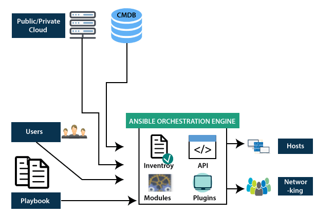
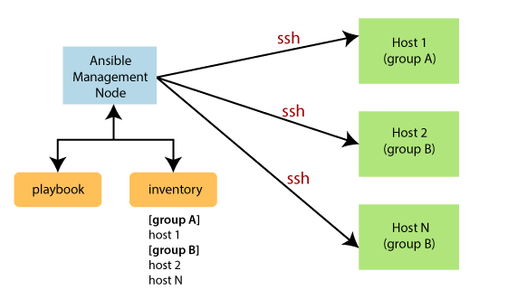

<h1 align="center">Tổng quan về Ansible</h1>

# I. Ansible là gì?
- Ansible là một trong những công cụ quản lý cấu hình hiện đại, tạo điều kiện cho việc cài đặt , quản lý và bảo trì server từ xa, với thiết kế tối giản giúp người dùng cài đặt và chạy nhanh chóng. Người dùng viết các tập lệnh cấp phép Ansible trong YAML, tiêu chuẩn tuần tự hóa dữ liệu thân thiện với người dùng và không bị ràng buộc bởi ngôn ngữ lập trình nào dẫn đến người dùng  có thể tạo ra các tập lệnh cấp phép phức tạp một cách trực quan hơn so với các công cụ còn lại trong cùng danh mục.

<h3 align="center"></h3>

- Ansible không yêu cầu người dùng phải cài đặt thêm bất kỳ phần mềm đặc biệt nào. Một máy điều khiển được cài đặt tích hợp trong phần mềm Ansible, và giao tiếp với các nút thông qua SSH tiêu chuẩn. Là công cụ quản lý cấu hình và tự động hóa, Ansible gói gọn tất cả các tính năng phổ biến có trong các công cụ khác cùng loại, trong khi vẫn đáp ứng được tính đơn giản và hiệu suất.

# II. Tại sao nên sử dụng Ansible
- Là một opensource và được sử dụng miễn phí.
- Sử dụng phương thức ssh
- Không tốn nhiều tài nguyên khi cài đặt
- Được phát triển bởi ngôn ngữ python, khi tạo thêm module cũng sẽ sử dụng ngôn ngữ này.
- Khá nhẹ và dễ setup
- Các sciprt chủ yếu được dùng định dạng YAML
- Trên Ansible có một cộng đồng tương tác lớn, dễ dàng giao lưu học hỏi.

# III. Ứng dụng của Ansible hiện nay

Ansible được sử dụng rất nhiều trong triển khai phần mềm và quản trị hệ thống:
- `Provisioning`: Khởi tạo VM, container hàng loạt trên cloud dựa trên API - OpenStack, AWS, Google Cloud, Azure…
- `Configuration Management`: Quản lý cấu hình tập trung các dịch vụ, không cần phải tốn công chỉnh sửa cấu hình trên từng server.
- `Application Deployment`: Deploy ứng dụng hàng loạt, giúp quản lý hiệu quả vòng đời của ứng dụng từ giai đoạn dev cho đến production.
- `Security & Compliance`: Quản lý các chính sách về an toàn thông tin một cách đồng bộ trên nhiều sản phẩm và môi trường khác nhau như deploy policy hay cấu hình firewall hàng loạt trên nhiều server,…

<h3 align="center"></h3>

# IV. Kiến trúc Ansible

<h3 align="center"></h3>

- Ansible thực hiện tương tác với các user viết nên các Ansible playbook để thực hiện điều phối và tương tác cùng các dịch vụ cơ sở dữ liệu được quản lý và cấu hình trên phương diện Private/Public, trong đó:
  - `Inventory`: Danh sách các note máy chủ có IP, địa chỉ , cơ sở dữ liệu cần quản lý,...
  - `API's`: Công cụ vận chuyển và giao tiếp cho các dịch vụ private và public
  - `Modules`: Thực hiện kết nỗi giữa các node, quảng bá rộng rãi các chương trình Ansible Modules. Ansible thực hiện và loại bỏ các Modules sau khi kết thúc. Có thể làm việc với trình soạn thảo văn bản đã chọn hoặc hệ thống kiểm soát phiên bản hoặc thiết bị đầu cuối để theo dõi những thay đổi trong nội dung
  - `Plugins`: Plugin là một đoạn mã sử dụng chức năng cốt lõi của Ansible. Có thể tự phát triển và viết ra nhiều plugin hữu ích

  - `Playbooks`: là một đoạn mã đã viết của bạn và chúng được viết ở định dạng YAML, mô tả các tác vụ và thực thi thông qua Ansible

  - `Hosts`: danh sach các node có thể sử dụng bất kể hệ điều hành nào như linux và windows

  - `Networking`: thực hiện quá trình tự động hóa các kết nối đến host

  # V. Mô hình hoạt động Ansible

- Ansible hoạt động bằng cách kết nối với các node và đẩy ra các chương trình nhỏ được gọi là mô-đun ansible. Ansible sau đó thực thi các mô-đun này qua SSH theo mặc định và sau đó xóa chúng khi hoàn tất.

<h3 align="center"></h3>

  - `Inventory`: Danh sách các note máy chủ có IP, địa chỉ , cơ sở dữ liệu cần quản lý,...
- Tại `Management Node` kiểm soát toàn bộ quá trình thực thi của pkaybook. Inventory cung cấp danh sách các máy chủ cần chạy các Modules Ansible
- Management Node quản lý tạo kết nối ssh và thực thi các Modules nhỏ trên máy chủ và cài đặt phần mềm

# VI. Các khái niểm sử dụng trong Ansible

- **Controller Machine**: Là máy cài Ansible, nó sẽ chịu trách nhiệm quản lý, điều khiển và gửi các task đến những máy con cần quản lý.
- **Inventory**: Là file chứa thông tin những server cần quản lý. File này thường nằm tại đường dẫn /etc/ansible/hosts.
- **Playbook**: Là file chứa các task được ghi dưới định dạng YAML. Máy controller sẽ đọc các task này trong Playbook sau đó đẩy các lệnh thực thi tương ứng bằng Python xuống các máy con.
- **Task**: Một block ghi lại những tác vụ cần thực hiện trong playbook và các thông số liên quan.
- **Module**: Trong Ansible có rất nhiều module khác nhau. Ansible hiện có hơn 2000 module để thực hiện các tác vụ khác nhau, bạn cũng có thể tự viết thêm những module của mình khi có nhu cầu. Một số Module thường dùng cho những thao tác đơn giản như: System, Commands, Files, Database, Cloud, Windows,...
- **Role**: Là một tập playbook đã được định nghĩa để thực thi 1 tác vụ nhất định. Nếu bạn có nhiều server, mỗi server thực hiện những tasks riêng biệt. Và khi này nếu chúng ta viết tất cả vào cùng một file playbook thì khá là khó để quản lý. Do vậy roles sẽ giúp bạn phân chia khu vực với nhiệm vụ riêng biệt.
- **Play**: là quá trình thực thi một playbook.

- **Facts**: Thông tin của những máy được Ansible điều khiển, cụ thể sẽ là các thông tin về OS, system, network,…

- **Handlers**: Được sử dụng để kích hoạt những thay đổi của dịch vụ như start, stop service.
    
- **Variables**: Được dùng để lưu trữ các giá trị và có thể thay đổi được giá trị đó. Để khai báo biến, người dùng chỉ cần sử dụng thuộc tính vars đã được Ansible cung cấp sẵn.
    
- **Conditions**: Ansible cho phép người dùng điều hướng lệnh chạy hay giới hạn phạm vi để thực hiện câu lệnh nào đó. Hay nói cách khác, khi thỏa mãn điều kiện thì câu lệnh mới được thực thi. Ngoài ra, Ansible còn cung cấp thuộc tính Register, một thuộc tính giúp nhận câu trả lời từ một câu lệnh. Sau đó ta có thể sử dụng chính kết quả đó để chạy những câu lệnh sau.

Ansible là công cụ giúp chuẩn bị trước và quản lý cấu hình, nó là cách đơn giản và dễ nhất để bắt đầu bởi nó chỉ sử dụng SSH để kết nối Server và chạy các Task được cấu hình từ trước. Ansible cũng giúp chúng ta dễ dàng chuyển đổi một Bash script thành các task trong Ansible cho quá trình quản lý. Ngoài ra, trước khi chạy các Task, người dùng có thể nhìn nhận trước ngữ cảnh và xử lý những giới hạn của chúng.

# VII. Tài liệu Tham khảo
- [1] https://serversforhackers.com/an-ansible-tutorial

- [2] https://www.javatpoint.com/ansible

- [3] https://www.lordlikely.com/phat-trin-sysadmin/gii-thiu-ansible-cho-ngi-mi-bt-u/