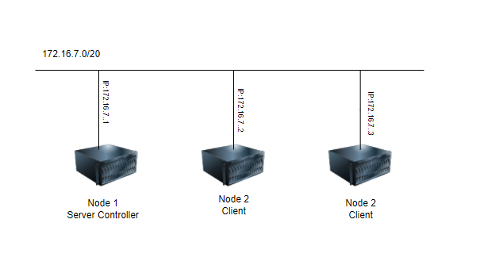

<h1 align="center">Hướng dẫn cài đặt triển khài Ansible trên Ubuntu20.04</h1>

# I. Chuẩn bị
## 1. Mô hình triển khai

<h3 align="center"></h3>

Trong đó:
- 1 Node Server sử dụng Ubuntu 20.04
- 2 Node client
  - mỗi node có 3 disk bao gồm : 1 OS 25GB và 2 DATA 30DB

  ## 2. IP Planning

| Hostname | hardware | Interface |
|--------------|-------|------|
| Node1 | 2 CPU - 2GB RAM - 30GB Disk| eth0: 10.10.13.31  (MNGT)- eth1: 10.10.11.31|
| MariaDB-2 | 2 CPU - 2GB RAM - 30GB Disk| eth0: 10.10.13.32 (MNGT)- eth1: 10.10.11.32|
| MariaDB-3 | 2 CPU - 2GB RAM - 30GB Disk| eth0: 10.10.13.33 (MNGT)- eth1: 10.10.11.33|