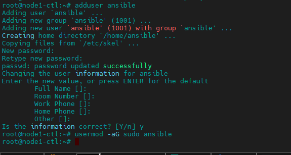
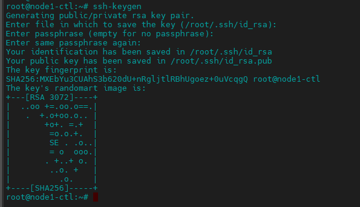
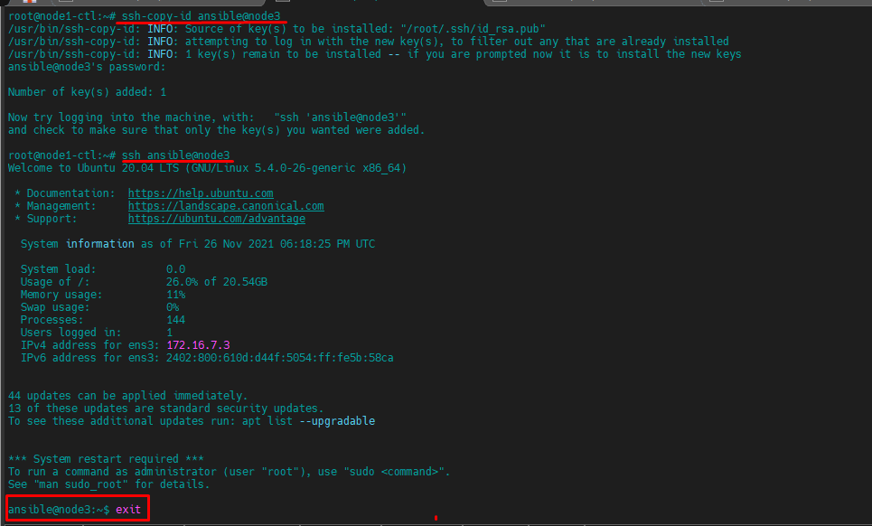
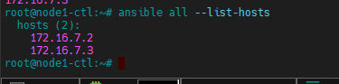
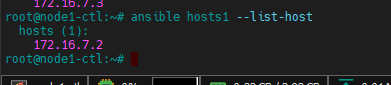
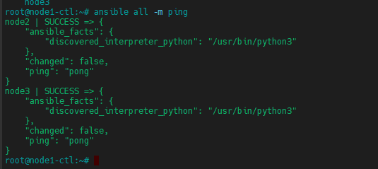
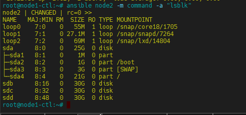
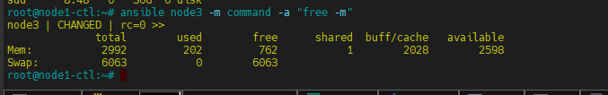

<h1 align="center">Hướng dẫn cài đặt triển khài Ansible trên Ubuntu20.04</h1>

# I. Chuẩn bị
## 1. Mô hình triển khai

<h3 align="center"></h3>

Trong đó:
- 1 Node Server sử dụng Ubuntu 20.04
- 2 Node client
  - mỗi node có 3 disk bao gồm : 1 OS 25GB và 2 DATA 30DB

## 2. IP Planning

| Hostname | hardware | Interface | Disk OS | Disk 1 | Disk 2 | Disk 3 |
|--------------|-------|------|------|------|------|------|
| Node1-ctl | 3 CPU - 3GB RAM| ens3: 172.16.7.1 |25GB | 30GB | 30GB | 30GB |
| Node2 | 3 CPU - 3GB RAM| ens3: 172.16.7.2 |25GB | 30GB | 30GB | 30GB |
| Node3 |  3 CPU - 3GB RAM| ens3: 172.16.7.3|25GB | 30GB | 30GB | 30GB |


## 3. Thiết lập ban đầu
> ## **`Thực hiện trên cả 3 Node`**
# II. Cài đặt
### Cập nhật gói, update OS
```sh
apt-get update -y 
apt-get upgrade -y 
apt-get dist-upgrade -y
apt-get autoremove 
```
### Disable firewalld
```sh
systemctl disable ufw
systemctl stop ufw
systemctl status ufw
```
### Khởi tạo user cho dịch vụ Ansible
-  Đứng từ user `root` khởi tạo 1 user `Ansible` với quyền admin sử dụng cho mục đích kết nối đến các node trong cụm
```sh
adduser ansible
usermod -aG sudo ansible
```
<h3 align="center"></h3>

### Add file hosts
```sh
echo "172.16.7.1 node1-ctl" >> /etc/hosts
echo "172.16.7.2 node2" >> /etc/hosts
echo "172.16.7.3 node3" >> /etc/hosts
```
### Khởi động lại
```
init 6
```

## 4. Cài đặt Ansible
> ## **`Thực hiện trên cả Node Controler: Node1-ctl`**

### Thực hiện thiết lập SSH key

- Đứng tại node AnsibleServer tạo SSH Key, sau đó copy các sang node còn lại. Mục tiêu là sử dụng keypair để không phải nhập password mỗi khi đăng nhập vào các client.
```sh
ssh-keygen
```
<h3 align="center"></h3>

- Thực hiện copy file key sang các node còn lại
```sh
ssh-copy-id root@node2
ssh-copy-id root@node3
```
<h3 align="center"></h3>

### Cài đặt ansible

- Thực hiên cài đặt Ansible trên 1 node có vai trò quản lý điều khiển tất cả các node còn lại, đó được gọi là node controller.

- Cài đặt bằng câu lệnh sau:
```sh
sudo apt install ansible -y
```
### Khai báo file inventory

- Mặc định thì danh sách các host mà AnsibleServer điều khiển sẽ nằm ở file /etc/ansible/host.
- tạo file backup
```sh
cp /etc/ansible/hosts /etc/ansible/hosts.bak
```
- thực hiện thêm thông tin danh sách các node trong bài lab vào file `/etc/ansible/hosts` có nội dung:
```sh
[hosts1]
172.16.7.2
[hosts2]
172.16.7.3
```
- kiểm tra danh sách các node đã được khai báo trong  file inventory

```sh
ansible all --list-hosts
```
<h3 align="center"></h3>

- trong trường hợp cần kiểm tra host trong các group ví dụ group: hosts1
```
ansible hosts1 --list-host
```
<h3 align="center"></h3>

- ở phiên bản Ansible 2.0 trở lên file `/etc/ansible/hosts` có thể thực hiện bổ sụng thêm 1 số tùy chọn về user và password
- nội dung sau khi chỉnh sửa:
```sh
[hosts1]
node2 ansible_host=172.16.7.2 ansible_port=22 ansible_user=ansible
[hosts2]
node3 ansible_host=172.16.7.3 ansible_port=22 ansible_user=ansible
```
trong đó:
 - node2: hostname của node
 - ansible_host: Địa chỉ IP tương ứng với hostname của node
 - ansible_port: Port SSH được sử dụng trên node tương ứng
 - ansible_user: User mà node controller sử dụng để tương tác với các node còn lại thông qua dịch vụ ssh


 ## Một số câu lệnh kiểm tra

 kiểm tra khai báo thông tin node chính xác hay chưa sử dụng câu lệnh ansible với các tùy chọn all là tất cả các node được khai báo, -m ping thể hiện sử dụng module ping để kiểm tra kết nối đến các node.
```sh
ansible all -m ping
```
<h3 align="center"></h3>

### Sử dụng module command

- Cấu trúc dòng lệnh:
```sh
ansible all -m command -a "ten_cau_lenh_module_command"
```

- ví dụ: 
  -  kiểm tra danh sách disk trên node 2 sử dụng lệnh `lsblk`
```sh
ansible node2 -m command -a "lsblk"
```
<h3 align="center"></h3>

  -  kiểm tra ram trên node 3 sử dụng lệnh `free -m`
```sh
ansible node3 -m command -a "free -m"
```
<h3 align="center"></h3>


# III. Tài liệu tham khảo
- [1] https://linuxhint.com/install_ansible_ubuntu/

- [2] https://github.com/phancong0897/Congphan/blob/master/Ansible/LAB/install-ansible.md
