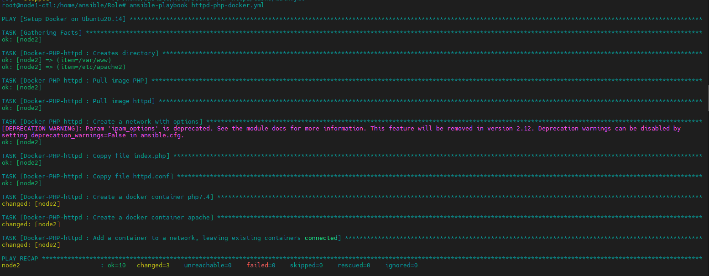
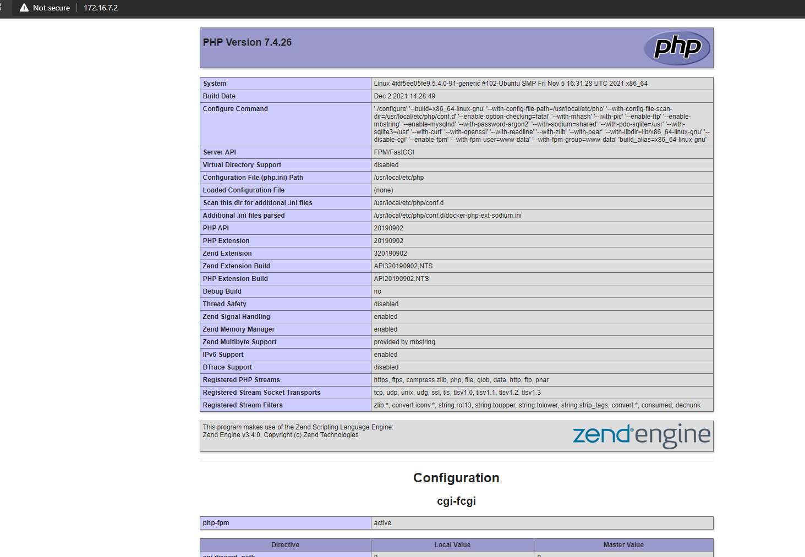

chạy lệnh
```sh
ansible-playbook httpd-php-docker.yml
```

- File: Unbuntu-docker.yml
  - Nội dung:
```sh
---
- name: Setup Docker on Ubuntu20.14
  hosts: hosts2
  become: yes

  roles:
      - Docker-ubuntu2004

```

- kết quả:

<h3 align="center"></h3>

<h3 align="center"></h3>

