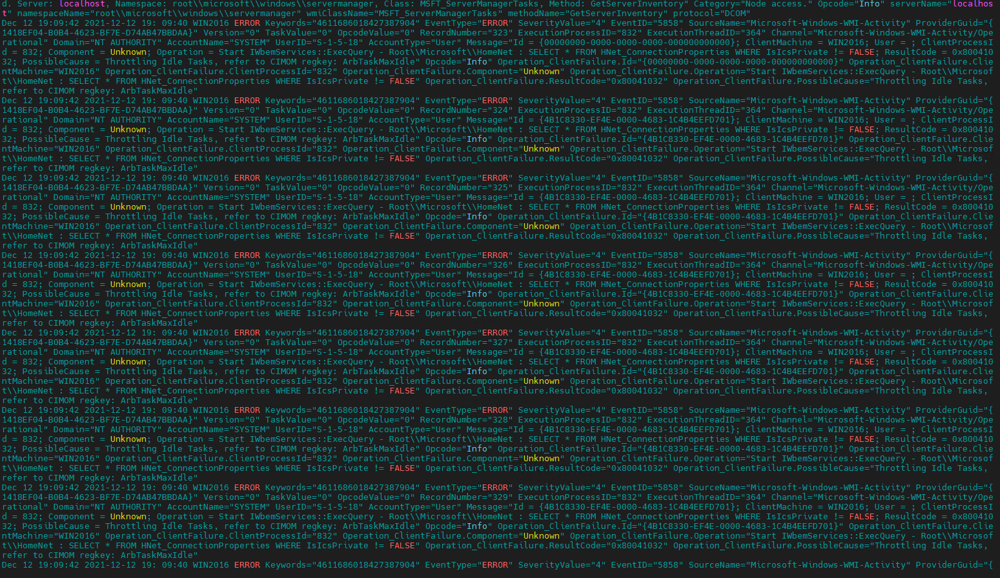

<h1 align="center">Ansible Role: Setup Nxlog on Windows Server 2016</h1>

## I. Thành Phần
- Nxlog
- WinRM
- Role
- Playbook

## II. Nội dung
### 1. Nxlog
- Một trình thu thập và chuyển tiếp nhật ký chung.
- Nxlog tương tự như syslog-ng hoặc rsyslog nhưng nó không chỉ giới hạn ở unix và syslog. Nó hỗ trợ các nền tảng, nguồn nhật ký và định dạng khác nhau để nxlog có thể là một lựa chọn lý tưởng để thực hiện một hệ thống ghi nhật ký tập trung
- Thu nhận nhật ký từ mạng từ xa qua UDP, TCP hoặc TLS / SSL trên tất cả các nền tảng được hỗ trợ
- Nó có khả năng lọc tin nhắn mạnh mẽ, viết lại nhật ký và khả năng chuyển đổi. Sử dụng một kiến ​​trúc nhẹ, mô-đun và đa luồng có thể mở rộng, nxlog có thể xử lý hàng trăm ngàn sự kiện mỗi giây.

<h3 align="center"></h3>
<h3 align="center">Mô hình triển khai</h3>


### 2. WinRM

- Windows Remote Management (WinRM) là một dịch vụ quản lý từ xa cho Windows.

#### 2.1 Enable WinRM on Client Windows Server 2016
> Lưu ý: thực hiện thao tác trên **`Powershell`**
- Bật chế độ Windows Remote Management (WinRM)
```sh
Enable-PSRemoting –force
```
- thiết lập cấu hình Default và phân quyền Read và Execute cho group Administrator
```ah
winrm configSDDL default
```
<h3 align="center"></h3>

- thiết lập cấu hình allow remote
```sh
Set-Item -Path WSMan:\localhost\Service\AllowUnencrypted -Value $true
winrm set winrm/config/client/auth '@{Basic="true"}'
winrm set winrm/config/service/auth '@{Basic="true"}'
```
- kiểm tra lại cấu hình config listener
```sh
winrm e winrm/config/listener
```
kết quả:
```sh
PS C:\Users\Administrator> winrm e winrm/config/listener
Listener
    Address = *
    Transport = HTTP
    Port = 5985
    Hostname
    Enabled = true
    URLPrefix = wsman
    CertificateThumbprint
    ListeningOn = 127.0.0.1, 172.16.7.5, ::1, 2001:0:2851:782c:10d3:3e18:8afb:82,
, fe80::5efe:172.16.7.5%5, fe80::10d3:3e18:8afb:82%3, fe80::8966:bf05:81e2:d42e%2
```

#### 2.2 Setup WinRM on Ansible server
- setup
```sh
apt install python3-pip
pip install pywinrm
```

- add file hosts Server
```sh
echo "172.16.7.5 Winserver2016" >> /etc/hosts
```

- add file : `/etc/ansible/hosts` có nội dung
```sh
[Winserver]
Winserver2016 ansible_host=172.16.7.5

[Winserver:vars]
ansible_user=Administrator
ansible_password=0962012918tT#
ansible_connection=winrm
ansible_port=5985
```

- kiểm tra kết nối:
```sh
ansible Winserver -i /etc/ansible/hosts -m win_ping
```
kết quả:
```sh
root@node1-ctl:/home/ansible/Role# ansible Winserver -i /etc/ansible/hosts -m win_ping
Winserver2016 | SUCCESS => {
    "changed": false,
    "ping": "pong"
}
root@node1-ctl:/home/ansible/Role#
```

### 3. Role
Thành Phần : 
- `default/main.yml` chứa thông tin về dường dẫn file thư mục cài đăt và cấu hình
```sh
---
INSTALLDIR: C:\Nxlog\
file_config: conf\
Folder_Agent: C:\AgentNxlog\
Agent_Nxlog: nxlog-trial-5.4.7313_windows_x64.msi
```

- `tasks/main.yml` thực thi các lệnh cài đặt và kiểm tra dịch vụ
```sh
- name: Installed Nxlog
  win_shell: msiexec /i {{ Folder_Agent }}\{{ Agent_Nxlog }} /qb INSTALLDIR={{ INSTALLDIR }}
```
  - check status nxlog
```sh
- name: Check Service status
  win_shell: Get-Service nxlog
  register: status

- debug: msg={{ status.stdout_lines }}
```

- `handler/main.yml`
```sh
---
- name: Restart-nxlog
  ansible.windows.win_service:
    name: nxlog
    state: restarted
```

### 3. Playbook
```sh
---
- name: Setup Nxlog on Windows Server
  hosts: Winserver

  roles:
      - Nxlog-Windows-Server
```
thực hiện chạy Setup và kết quả nhận được

<h3 align="center"></h3>


<h3 align="center"></h3>
