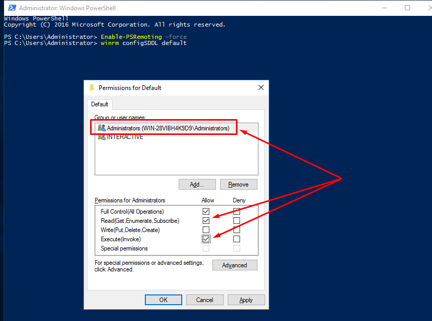

<h1 align="center">Hướng dẫn thiết lập tương tác giữa Ansible và Windows Server 2016</h1>

## 1. WinRM
- Windows Remote Management (WinRM) là một dịch vụ quản lý từ xa cho Windows.

- Giao thức WS-Management cung cấp một phương thức chung cho các hệ thống truy cập và trao đổi thông tin quản lý trên cơ sở hạ tầng CNTT. WinRM và Giao diện quản lý nền tảng thông minh (IPMI), cùng với Trình thu thập sự kiện là các thành phần của các tính năng Quản lý phần cứng của Windows.

## 2. Enable WinRM on Client Windows Server 2016
> Lưu ý: thực hiện thao tác trên **`Powershell`**
- Bật chế độ Windows Remote Management (WinRM)
```sh
Enable-PSRemoting –force
```
- thiết lập cấu hình Default và phân quyền Read và Execute cho group Administrator
```ah
winrm configSDDL default
```
<h3 align="center"></h3>

- thiết lập cấu hình allow remote
```sh
Set-Item -Path WSMan:\localhost\Service\AllowUnencrypted -Value $true
winrm set winrm/config/client/auth '@{Basic="true"}'
winrm set winrm/config/service/auth '@{Basic="true"}'
```
- kiểm tra lại cấu hình config listener
```sh
winrm e winrm/config/listener
```
kết quả:
```sh
PS C:\Users\Administrator> winrm e winrm/config/listener
Listener
    Address = *
    Transport = HTTP
    Port = 5985
    Hostname
    Enabled = true
    URLPrefix = wsman
    CertificateThumbprint
    ListeningOn = 127.0.0.1, 172.16.7.5, ::1, 2001:0:2851:782c:10d3:3e18:8afb:82,
, fe80::5efe:172.16.7.5%5, fe80::10d3:3e18:8afb:82%3, fe80::8966:bf05:81e2:d42e%2
```

# 3. Setup WinRM on Ansible server
- setup
```sh
apt install python3-pip
pip install pywinrm
```

- add file hosts Server
```sh
echo "172.16.7.5 Winserver2016" >> /etc/hosts
```

- add file : `/etc/ansible/hosts` có nội dung
```sh
[Winserver]
Winserver2016 ansible_host=172.16.7.5

[Winserver:vars]
ansible_user=Administrator
ansible_password=0962012918tT#
ansible_connection=winrm
ansible_port=5985
```

- kiểm tra kết nối:
```sh
ansible Winserver -i /etc/ansible/hosts -m win_ping
```
kết quả:
```sh
root@node1-ctl:/home/ansible/Role# ansible Winserver -i /etc/ansible/hosts -m win_ping
Winserver2016 | SUCCESS => {
    "changed": false,
    "ping": "pong"
}
root@node1-ctl:/home/ansible/Role#
```


# Tài liệu tham khảo

- https://docs.ansible.com/ansible/2.9/modules/list_of_windows_modules.html
- https://docs.ansible.com/ansible/2.7/modules/win_msi_module.html
- https://nxlog.co/documentation/nxlog-user-guide/deploy-windows.html
- https://www.ansible.com/blog/connecting-to-a-windows-host